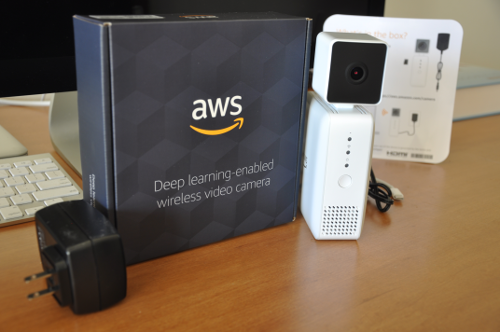

# AWS Deeplens camera
AWS camera for developers. Setup, thoughts and experiments...



[✍ Steps to register camera with AWS](registration.md)

# Video stream over SSH

```
ssh aws_cam@IP_ADDRESS cat /opt/awscam/out/ch1_out.h264  | mplayer -demuxer h264es -
```
* Use IP_ADRESS of your camera on local network.
