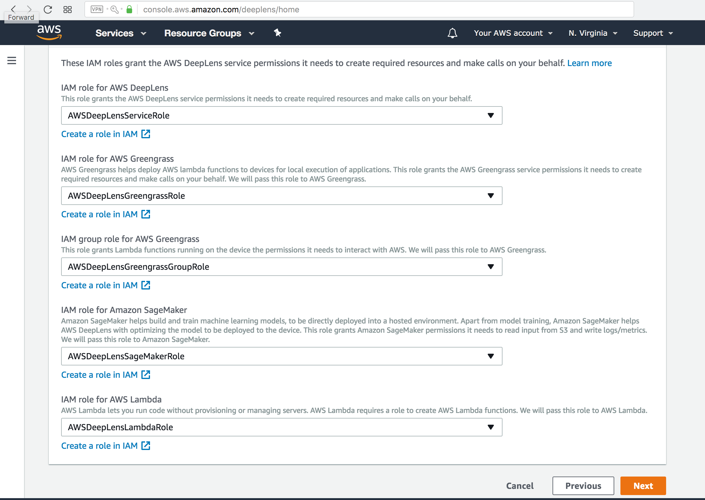

Camera Registration
===================

* Sign in at https://concole.aws.amazon.com

* Start device registration at  https://concole.aws.amazon.com/deeplens

* Register new IAM for the camera

* Download certificates for the camera/device

* Connect device to network via Wifi or USB-Ethernet

## Local setup on device:

❗Please make sure you are on <b>trusted WiFi</b> or local network where all devices are known and trusted. Otherwise any unknown or compromised device may sniff your device password setup and security certificates.

* Upload certificate zip

* Password/SSH setup

* Final confirmation

Back in AWS console you should see newly registered deeplens device:

